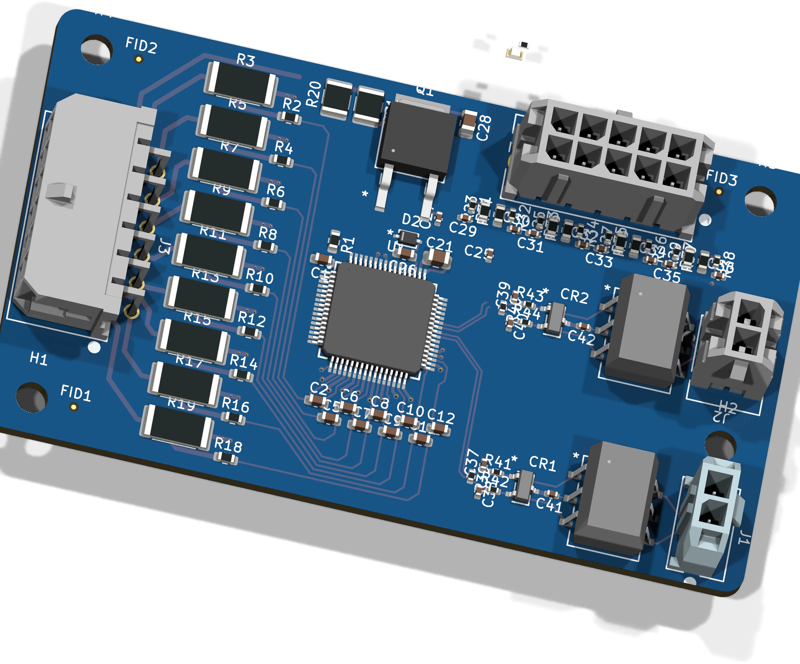
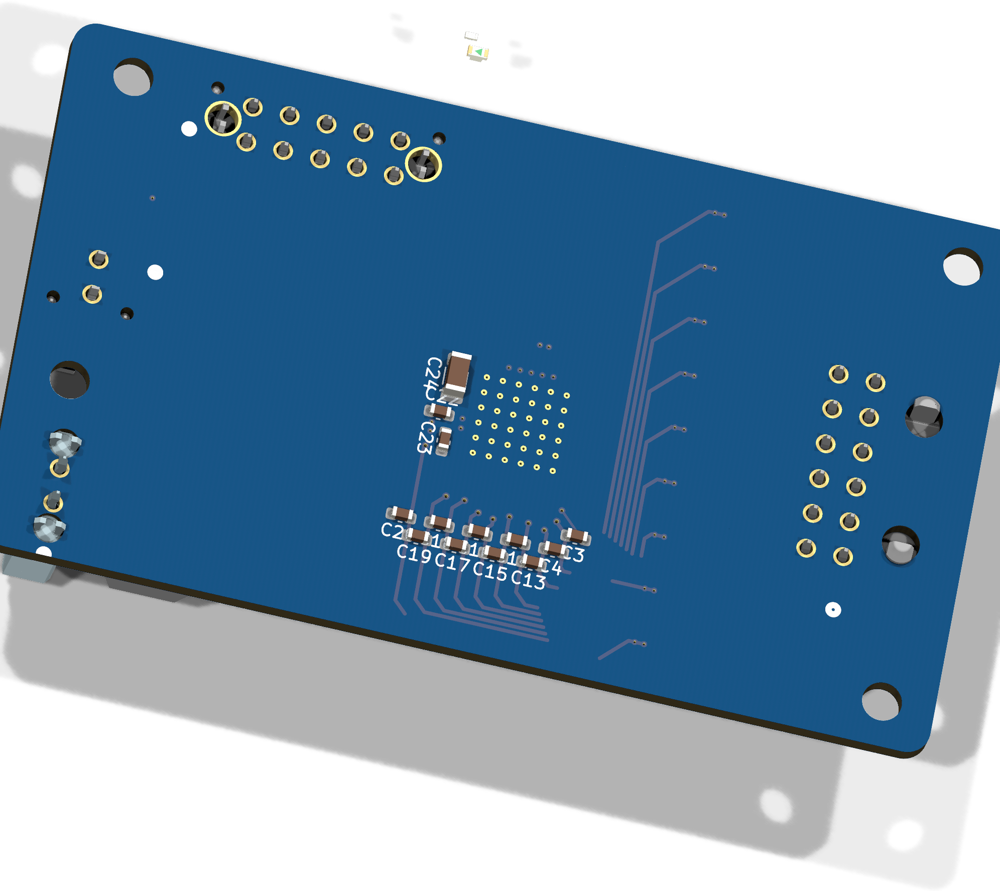

  

<h1 align="center">BMS_SLAVE</h1>

BMS Slave

<em>Slave BMS board that balances 8s cells, and reads temp for enepaq based temp sensors.</em>

  

    

***

  
&nbsp; &nbsp; &nbsp; &nbsp;
  

***

## SPECIFICATIONS

| Parameter | Value |
| --- | --- |
| Dimensions | 77.0 × 45.0 mm |
| Company | Blue Devil Motor Sports |
| Designer | Aidan Brzezinski |
| Revision | + (Unreleased) |

***

## WORKING ON THIS BOARD

> This file is regenerated automatically on every CI run — don't edit it by
> hand. For the full contributor guide (setup, daily commands, commit
> conventions, PR etiquette, and what to do when something goes wrong), see
> the [board_template README](https://github.com/BDMPowertrain/board_template#readme).

**Change the variant** as the board moves through Design → Procurement →
Fabrication:

    ./configure.sh --variant

**Change board metadata** (title, description, designer, company):

    ./configure.sh

RELEASED is never set by hand — push a version tag and CI produces it
automatically:

    git tag 1.0.0
    git push origin 1.0.0
